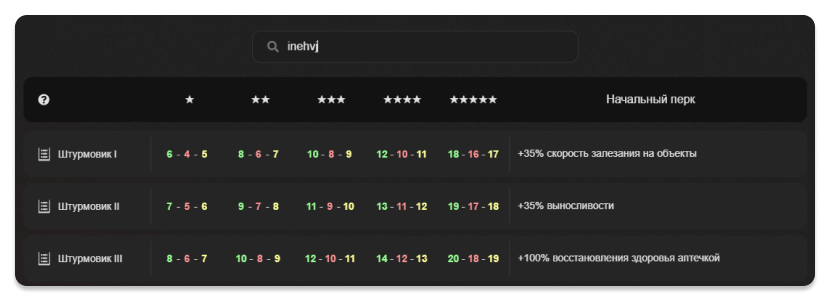
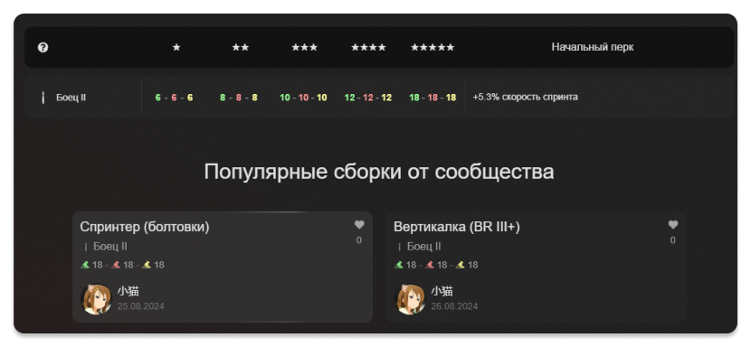
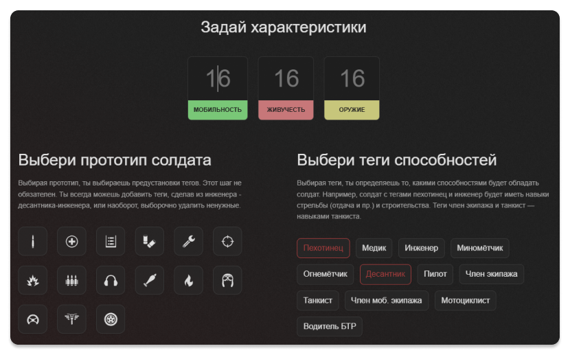
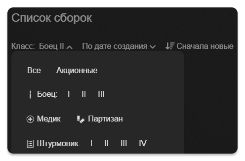
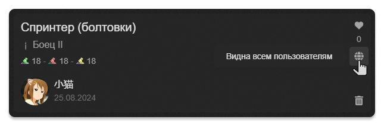
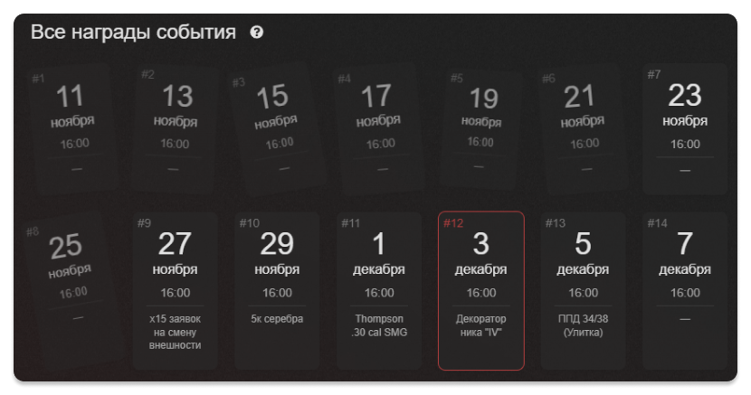
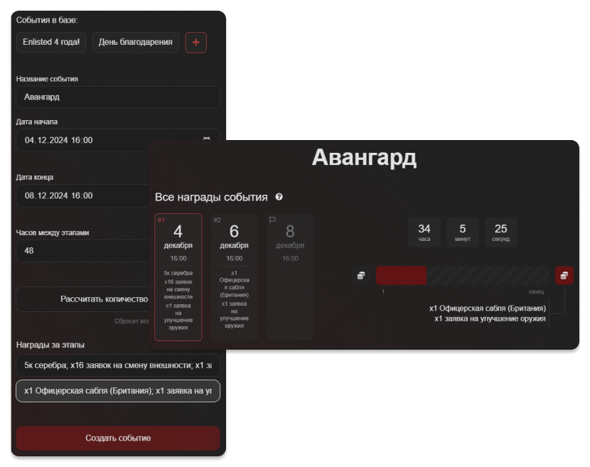

[Перейти на сайт →](https://enlisted-stats.web.app/)

**Enlisted Stats** — это сайт-хелпер для игры [Enlisted](https://enlisted.net/). Он помогает решать следующие задачи:

- создавать, хранить и делиться сборками бойцов
- отслеживать дату начала нового этапа события
- перерасчитывать награды с учетом пропущенных этапов

> [!NOTE] > **Использованные технологии:** Vue 3 Composition API, TypeScript, Vue Router, Vuex, Firebase (аутентификация), Firestore (БД), SCSS.

# Сборки

Главная страница является **таблицей бойцов**, где можно узнать:

- максимальные характеристики бойца на каждом уровне
- начальные перки для всех классов

Для удобства реализован **умный поиск**: он корректно работает с опечатками и непереведенной английской раскладкой.

## Выбор солдата

Кликнув по ячейке бойца с таблицы, откроется расширенное меню действий, где можно посмотреть **популярные сборки сообщества**, или создать собственную уникальную сборку.

## Создание сборки

В разделе "Создать свою сборку" ты можешь:

1. вручную распределить характеристики бойца
2. сохранить сборку (доступно для авторизованных пользователей), задав название и **видимость** (публичная или приватная)

### Акционные/премиумные отряды

Для бойцов из акционных или премиумных отрядов сборка создаётся во вкладке "Калькулятор". тут нужно указать:

- максимальные характеристики солдата
- набор тегов (например, является ли солдат инженером, или, например, танкистом)

# Работа со сборками

В разделе "Сборки" доступны фильтры, которые помогут искать сборку с нужными параметрами, например:

- класс бойца
- сортировки:
  - по популярности
  - по новизне
  - в определенном порядке (возрастание/убывание)

## Редактирование сборки

Автор может редактировать свои сборки: изменять прокачку способностей, а так же название или **видимость** (публичная/приватная).

**Приватные сборки** отображаются только на странице "Мои Сборки". Сборка становится приватной, если она:

- создана как копия чужой сборки (кнопка "Сохранить" на странице чужой сборки)
- была сохранена с приватной видимостью, или видимость была переключена

### Избранные сборки

Понравилась сборка? Жми "мне нравится", и она:

- сохранится во вкладке "Сохраненные"
- получит больший приоритет в разделе "Популярные сборки сообщества"

# События

Время от времени, в игре проходят события, приуроченные к историческим датам.

Они обновляются каждые 48 часов, и следить за ними бывает проблематично, например, считать вручную от даты начала каждые 2 суток, чтобы определить, когда будет начат новый этап: сегодня или завтра.

Поэтому, сайт показывает:

- список карточек с началом этапа и его наградой
- таймер следующего этапа и текущей и следующей наградой

## Отслеживание пропущенных этапов

Если один или несколько этапов события были пропущены, сайт позволяет отметить их, нажав по карточке с пропущенной датой.
После этого система автоматически пересчитает награды и покажет, к какой дате ты сможешь получить нужную вещь.

## Добавление события

Пользователи с правами администратора могут добавлять новые события через специальную панель.

Здесь можно настроить:

- название события
- даты начала и окончания
- интервал между этапами
- награды для каждого этапа

# Настройки

В разделе "Настройки" доступны два типа параметров:

**настройки профиля**:

- изменить отображаемое имя
- удалить учётную запись

**настройки сайта**:

- сделать калькулятор компактным, чтобы он помещался на одном экране
- отображать награды событий прямо на карточке, убрав их из всплывающих подсказок, пожертвовав дизайнов в угоду беспорядочности
